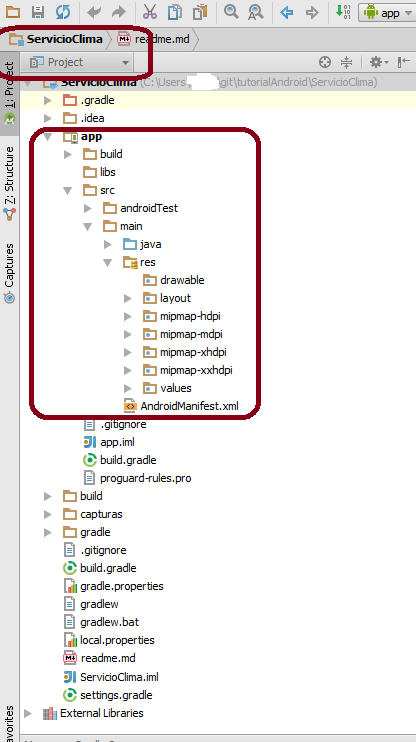
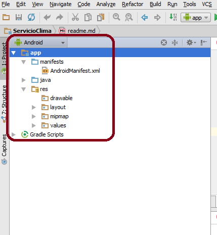
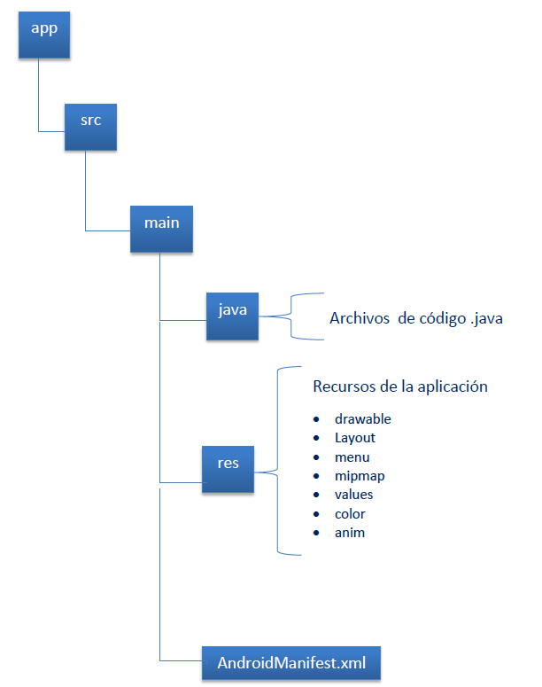
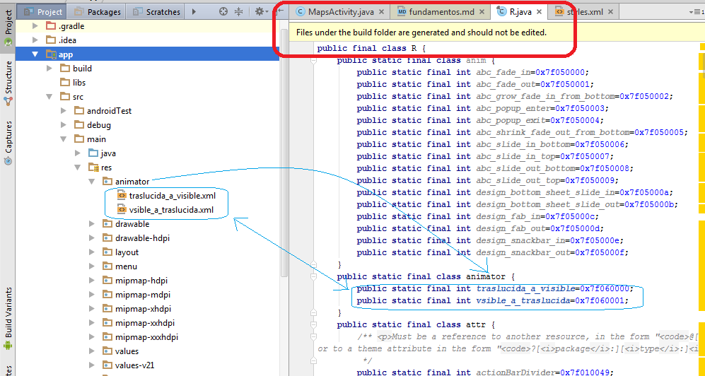

# Introducción a las aplicaciones Android

Las aplicaciones **Android** se desarrollan en el lenguaje de programación **Java** utilizando el **SDK**,  algunos componentes de código pueden ser desarrollado en **C**, solo recomendado si es necesario mayor consumo de recursos y uso intensivo del procesador. Las interfaces gráficas pueden ser desarrolladas en el lenguaje de marcado **XML**. 

Están definidos cuatro (4) componentes básicos para las aplicaciones **Android**:

1. **Activity:** es un componente de aplicación que provee una pantalla con interfaz de usuario.
2. **Service:** es un componente de aplicación que ejecuta tareas prolongadas en segundo plano y no implementa una interfaz de usuario.
3. **ContentProvider:** Gestiona el intercambio de datos entre aplicaciones, los datos almacenados en archivos y bases de datos son privados para cada aplicación, estos se hacen visibles a las demás aplicaciones a través de este componente.
4. **BroadcastReceiver:** Es un componente que responde a mensajes de difusión del sistema. El sistema envía mensajes de difusión a las aplicaciones registradas para que desencadenen acciones específicas de funcionamiento, algunos de estos mensajes son los que se originan cuando el nivel de batería es bajo, cuando el dispositivo se ha iniciado por completo o cuando se ha recibido un mensaje de texto. 

***

**NOTA:** Las aplicaciones android pueden estar conformadas por **uno**, **algunos** o todos los componentes básicos.

***

Todos los componentes básicos de la aplicación deben ser declarados en el [archivo de manifiesto]()las versiones más antiguas del **Android SDK** y el IDE Eclipse con el plugin ADT, requerian el desarrollo de esta tarea manualmente, es decir, cada vez que se creaba un componente, se debia editar el archivo manifiesto para incluirlo. Las nuevas versiones del SDK y Android Studio han automatizado este proceso.

##Estructura de un proyecto Android

En **Android Studio** hay varias perspectivas de exploración de los archivos del poyecto dos de estas se presentan en las figuras siguientes

Explorador en vista  **project**

Explorador en vista **Android**
 

La estructura del módulo de aplicación de un proyecto **Android** se observa en la siguiente imagen

El directorio de recursos **(res)** contiene subdirectorios que almacenan los componentes de la interfaz gráfica de la aplicación, archivos y recursos multimedia. El sistema crea referencias para los archivos guardados en el directorio **res** en el archivo **R.java** en el directorio **build**, este archivo es generado automáticamente por el sistema y no debe ser modificado.
El archivo __R.java__ es una **clase** java, cada uno de los subdirectorios dentro del directorio **res** genera una clase estática final interna a la clase R, y a los archivos dentro del subdirectorio les es generado un identificador estático entero. El identificador sirve para hacer referencia a los recursos en el código java de la aplicación. En la figura siguiente se presenta un ejemplo del identificador generado por el sistema para los recursos del tipo **animator** cargados para un proyecto en particular.

##Archivo Manifiesto

Antes de instalarse y ejecutarse una aplicación el sistema debe conocer los componentes de aplicación que existen buscando su declaración en el archivo **AndroidManifest.xml**.

El archivo manifiesto guarda la descripción de los siguientes elementos:

* Versión mínima del **API Android** que soporta la aplicación.
* Permisos de usuario para la aplicación, por ejemplo el uso de internet, bluetooth o la lectura de contactos en la agenda del teléfono.
* Lista de [componentes de aplicación](#componentes).

