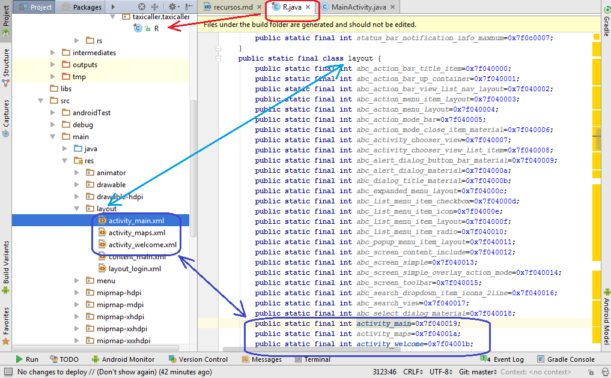

# Recursos de la Aplicación

Los recursos de la aplicación se encuentran en el árbol del proyecto en el directorio **res**. En el directorio de recursos se pueden encontrar, entre otros, los siguientes elementos:

1. [**Drawables:**](http://developer.android.com/intl/es/guide/topics/resources/drawable-resource.html) Elementos de imágenes a ser utilizados en la interfaz gráfica.
  * [**BitmapDrawable**](http://developer.android.com/intl/es/reference/android/graphics/drawable/BitmapDrawable.html) Recursos de mapas de bits o imagenes generados a partir archivos de imagen en formatos png, jpg o gif.
  * [**Shape Drawable**](http://developer.android.com/intl/es/guide/topics/resources/drawable-resource.html#Shape). Elemento que define la forma de otros elementos de la interfaz gráfica, fondo, bordes, gradientes, bordes de las esquinas, etc.
  * [**State List**](http://developer.android.com/intl/es/guide/topics/resources/drawable-resource.html#StateList). Es un elemnto definido en un archivo xml que utiliza diferentes elemnetos **drawable** para representar distintos estados de un elemento de la interfaz gráfica como botones y campos de texto, los estados pueden ser **presionado**, **enfocado**, **seleccionado**, entre otros.
2. **Layouts:** Elementos de presentación de la interfaz gráfica, son archivos **xml** que describen la disposición de los elementos de la interfaz gráfica.
3. **mipmap:** Directorios que contienen los iconos que identifican la aplicación.
4. **values:** Directorio de recursos genéricos definidos en archivos xml. Los recursos genéricos son de los siguientes tipos:
 * **Strings:** Guarda una lista de cadenas de texto que es mapeada en la aplicación para ser presentada en la interfaz gráfica según sea requerida.
 * **Styles:** Guarda una definición de estilos para la presentación de la interfaz gráfica.
 * **Dimen:** Guarda una lista de dimensiones para los elementos de la interfaz gráfica.
 * **Colores** Referencia la paleta de colores a ser utilizados en la interfaz gráfica.
El sistema genera automáticamente una referencia los elementos presentes en el directorio de recursos, dicha referencia es un número entero que se encuentra en el archivo **R.java.** La referencia sirve para crear instancias de los recursos en el código, por ejemplo para cargar una vista a un **Activity** se utiliza la instrucción `setContentView(R.layout.nombre_layout)`, de esta manera se hace referencia a un recurso del tipo **layout** con nombre "nombre_layout".

En la siguiente figura se presenta un ejemplo de los identificadores generados automáticamente por el sistema para algunos archifvos del tipo **layout**.



En el código java del **Activity** la referencia al recurso se haría a través del identificador estático: ´setContentView(R.layout.activity_main)´.


El siguiente ejemplo muestra la definición de recursos del tipo **string** en el archivo **values>strings.xml**
```xml
<resources>
    <string name="app_name">HolaAndroid</string>
    <string name="string_saludo">¡¡Hola Android!!</string>
</resources>
```

***

>>**Nota:** una buena práctica es definir todos los **strings** utilizados en la interfaz gráfica como recursos<< xml.

***

Los strings serán referenciados en el código **Java** en forma estática, por ejemplo: `R.string.nombre_string`. En otros archivos de recursos **xml** la referencia a strings ya definidos se realiza a través de la siguiente sintaxis: `@string\nombre_string`. Por ejemplo para cargar el texto en un **TextView** definido en un archivo de **layout** en el siguiente fragmento de código:

```xml
<?xml version="1.0" encoding="utf-8"?>
<LinearLayout xmlns:android="http://schemas.android.com/apk/res/android"
    android:layout_width="match_parent" android:layout_height="wrap_content"
    android:gravity="center">

    <TextView
        android:layout_width="wrap_content"
        android:layout_height="wrap_content"
        android:text="@string/string_saludo"
        android:id="@+id/textView"
        android:textStyle="bold"
        android:textSize="40sp" />
</LinearLayout>
```

En el ejemplo anterior se observa la instrucción `android:id="@+id/textView"`, el signo **"+"** le dice al sistema que debe crear un identificador para el recurso.